# Arrays 📦

An **Array** is a collection of elements of the same data type placed in a **contiguous memory location**.

### Key Characteristics:
- **Zero-based Indexing**: The first element is at index `0`.
- **Memory Efficiency**: In memory, the size of every block depends on the data type (e.g., 4 bytes for `int`).
- **Fixed Size**: Once defined, the size of an array cannot be changed.

> [!TIP]
> **Visualization** of data structures is crucial! We typically represent arrays in a straight line to understand contiguous memory allocation.

### Memory Representation
In a 4-byte integer array, addresses increment by 4 for each index.

```mermaid
flowchart LR
    subgraph Heap_Memory["Heap Memory (Contiguous)"]
        A0["Index 0\nValue: 99\nAddress: 1000–1003"]
        A1["Index 1\nValue: 98\nAddress: 1004–1007"]
        A2["Index 2\nValue: 82\nAddress: 1008–1011"]
    end

    A0 -->|"+4 bytes"| A1
    A1 -->|"+4 bytes"| A2
```

