# Arrays 📦

An **Array** is a collection of elements of the same data type placed in a **contiguous memory location**.

## Table of Contents
- [Space & Time Complexity Primer](#space--time-complexity-primer)
- [Key Characteristics](#key-characteristics)
- [Memory Representation](#memory-representation)
- [Array Creation](#array-creation)
- [Passing Arrays to Functions (Pass by Value)](#passing-arrays-to-functions-pass-by-value)

---

## Space & Time Complexity Primer

Before diving deep into Arrays, it's essential to understand how we measure the efficiency of our code.

> [!NOTE]
> **Scenario**: Imagine you give 100 Rupees to one of your friends. Having them all together, you would like your pen back.

### Space Complexity
Space Complexity is a function that describes the amount of **memory (RAM)** an algorithm needs to run until completion.
- **In our scenario**: Think of it as the number of rooms you need to figure out who has the pen.
- **In Computer Science**: It measures how much memory the processes and data structures (like arrays) take up.

### Time Complexity
Time Complexity is a function that describes the amount of **time** an algorithm takes to run. 

> [!IMPORTANT]
> In Computer Science, Time Complexity is not measured in seconds (which depends on hardware) but by the **number of operations** (statement executions) an algorithm performs.

#### Types of Time Complexities (Fastest to Slowest)
1. **Best Case**: The minimum time required (fastest possible).
2. **Average Case**: The average time taken over many runs.
3. **Amortized**: The average time per operation when run consecutively many times.
4. **Worst Case**: The absolute maximum operations required (most common measure).

#### Big O Examples
- **O(1) - Constant**: You remember who has the pen and go to them directly.
- **O(log n) - Logarithmic**: Divide the friends into two rooms. Ask which room has the pen. Repeat with the remaining group until found.
- **O(n) - Linear**: You ask each friend one by one if they have the pen.
- **O(n²) - Quadratic**: You ask one friend if they have the pen, then ask them if any of the other 99 friends have it. Repeat for every friend.

---

## Key Characteristics
- **Zero-based Indexing**: The first element is at index `0`.
- **Memory Efficiency**: Size of every block depends on the data type (e.g., 4 bytes for `int`).
- **Fixed Size**: Once defined, the size of an array cannot be changed.

> [!TIP]
> **Visualization** of data structures is crucial! We typically represent arrays in a straight line to understand contiguous memory allocation.

---

## Memory Representation
In a 4-byte integer array, addresses increment by 4 for each index.

```mermaid
flowchart LR
    subgraph Heap_Memory["Heap Memory (Contiguous)"]
        A0["Index 0\nValue: 99\nAddress: 1000–1003"]
        A1["Index 1\nValue: 98\nAddress: 1004–1007"]
        A2["Index 2\nValue: 82\nAddress: 1008–1011"]
    end

    A0 -->|"+4 bytes"| A1
    A1 -->|"+4 bytes"| A2
```



---

## Array Creation

### Syntax
```java
// Declaration and Memory Allocation
int marks[] = new int[5];

// Initialization with values
int marks[] = {1, 2, 3}; 
```

### Breakdown
- **Declaration**: `int marks[]` defines the name and type. The variable `marks` holds a **reference** (memory address) to the actual array.
- **Creation**: The `new` keyword performs three essential steps:
    1. **Allocation**: Finds space in the Heap memory.
    2. **Initialization**: Assigns default values (e.g., `0` for `int`) if none are provided.
    3. **Reference Return**: Returns the address of the first element.

> [!NOTE]
> In Java, the array variable itself is just a **reference** pointing to the actual data in memory.

---

## Passing Arrays to Functions (Pass by Value)

In Java, **everything is passed by value**. When you pass an array to a method, you are passing the **value of the reference** (the address).

### Key Concepts
1. **Modifying Content**: Since both the original and formal parameters point to the same memory location, changed content persists.
2. **Reassigning Reference**: If you point the parameter to a *new* array, it does not affect the original variable in the calling method.

### Examples

```java
public static void update(int marks[]) {
    for (int i = 0; i < marks.length; i++) {
        marks[i] = marks[i] + 1; // Changes reflecting in main
    }
}

public static void changeRef(int[] arr) {
   arr = new int[2];  // Reassigning local reference
   arr[0] = 15;       // Only affects the local new array
}
```

### Visualizing the Copy Mechanism
When `change(x)` is called, the value in `x` (the reference) is copied into `arr`.


> [!IMPORTANT]
> `x` and `arr` are distinct variables in the stack, but they initially point to the same object in the heap.

// Linear search means we search line by line 

+ (Linear search)[./PartOne/LinearSearch.java]

+ (Largest Number)[./PartOne/LargestNumber.java]


// Binary search

Binary Search is like dictionary search. we search in the middle and then move to the left or right based on the comparison.

// ARRAY must be sorted to perform binary search

+ first we find the middle element
+ then we compare the middle element with the key
+ if the middle element is greater than the key, we search in the left half by updating the end index
+ if the middle element is less than the key, we search in the right half by updating the start index
+ if the middle element is equal to the key, we return the index
+ (Binary Search)[./PartOne/BinarySearch.java]


