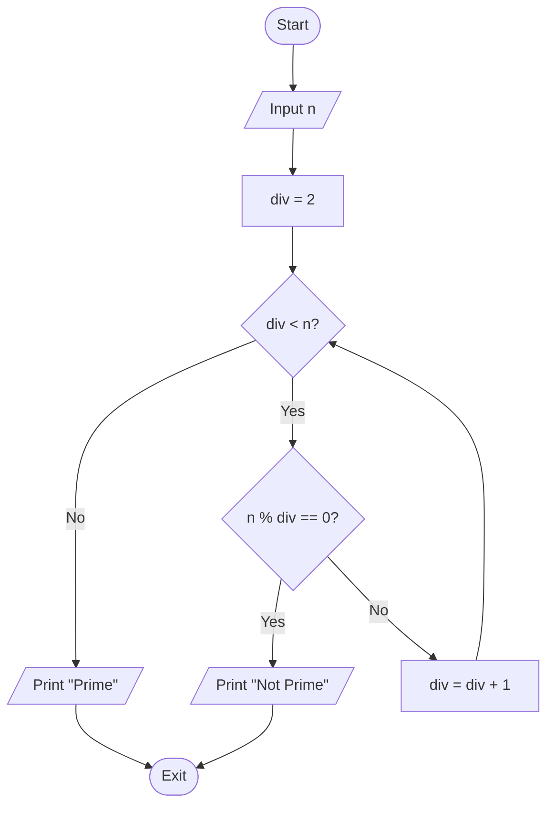

### FLOWCHART : Diagram to represent solution to a problem 

+ Dividing the Problem into smaller parts
+ Arranging them logically 

**Table of Contents**
1. [Components](#components-of-flowchart)
2. [Examples](#examples-of-flowchart)
    - [Sum of Two Numbers](#1-sum-of-two-numbers)
    - [Calculate Simple Interest](#2-calculate-simple-interest)
    - [Max of Three Numbers](#3-max-of-three-numbers)
    - [Find if a Number is Prime](#4-find-if-a-number-is-prime)
    - [Sum of First N Natural Numbers](#5-sum-of-first-n-natural-numbers)
3. [Practice Questions](#practice-questions)

#### Components of Flowchart

+ Start / Exit : <div style="width: 50px; height: 20px; background-color: #000000; border-radius: 50%; display: inline-block; text-align: center; color: white; line-height: 20px;">start</div>

+ Input / Output : <div style="width: 80px; height: 30px; background-color: #000000; transform: skew(-20deg); display: inline-block; text-align: center; color: white; line-height: 30px;">Input</div>

+ Process : <div style="width: 80px; height: 30px; background-color: #000000; display: inline-block; text-align: center; color: white; line-height: 30px;">Process</div>
+ Decision : <div style="width: 30px; height: 30px; background-color: #000000; transform: rotate(45deg); display: inline-block; vertical-align: middle; margin: 10px;"></div>
+ Connector : <div style="display: inline-block; font-size: 30px; vertical-align: middle; line-height: 30px;">&rarr;</div>


#### Examples of Flowchart

##### 1. Sum of Two Numbers

**Input:**
- First Number: `a`
- Second Number: `b`

**Output:**
- Sum of `a` and `b`

**Flowchart:**


**Pseudo-code:**
```text
BEGIN
    READ a
    READ b
    CALCULATE sum = a + b
    PRINT sum
END
```

##### 2. Calculate Simple Interest

**Input:**
- Principal Amount: `P`
- Rate of Interest: `R`
- Time: `T`

**Output:**
- Simple Interest: `SI`

**Flowchart:**

```mermaid
flowchart TD
    Start([Start]) --> Input[/Input P, R, T/]
    Input --> Process[SI = (P * R * T) / 100]
    Process --> Print[/Print SI/]
    Print --> End([Exit])
```

**Pseudo-code:**
```text
BEGIN
    READ P
    READ R
    READ T
    CALCULATE SI = (P * R * T) / 100
    PRINT SI
END
```

##### 3. Max of Three Numbers

**Input:**
- First Number: `a`
- Second Number: `b`
- Third Number: `c`

**Output:**
- Maximum of `a`, `b`, and `c`

**Flowchart:**


**Pseudo-code:**
```text
BEGIN
    READ a
    READ b
    READ c
    IF a > b THEN
        IF a > c THEN
            PRINT a
        ELSE
            PRINT c
        ENDIF
    ELSE
        IF b > c THEN
            PRINT b
        ELSE
            PRINT c
        ENDIF
    ENDIF
END
```

##### 4. Find if a Number is Prime

**Input:**
- Number: `n`

**Output:**
- Prime or Not Prime

**Flowchart:**



**Pseudo-code:**
```text
BEGIN
    READ n
    SET div = 2
    WHILE div < n
        IF n % div == 0 THEN
            PRINT "Not Prime"
            EXIT
        ELSE
            div = div + 1
        ENDIF
    ENDWHILE
    PRINT "Prime"
END
```

**Optimized Version:**

```mermaid
flowchart TD
    Start([Start]) --> Input[/Input n/]
    Input --> Init[div = 2]
    Init --> LoopCheck{div <= sqrt(n)?}
    
    LoopCheck -- Yes --> DivCheck{n % div == 0?}
    LoopCheck -- No --> PrintPrime[/Print "Prime"/]
    
    DivCheck -- Yes --> PrintNotPrime[/Print "Not Prime"/]
    DivCheck -- No --> Increment[div = div + 1]
    
    Increment --> LoopCheck
    
    PrintPrime --> End([Exit])
    PrintNotPrime --> End
```

**Pseudo-code:**
```text
BEGIN
    READ n
    SET div = 2
    WHILE div <= sqrt(n)
        IF n % div == 0 THEN
            PRINT "Not Prime"
            EXIT
        ELSE
            div = div + 1
        ENDIF
    ENDWHILE
    PRINT "Prime"
END
```
##### 5. Sum of First N Natural Numbers

**Input:**
- Number: `n`

**Output:**
- Sum of First `n` Natural Numbers

**Flowchart:**


**Pseudo-code:**
```text
BEGIN
    READ n
    SET sum = 0
    SET i = 1
    WHILE i <= n
        sum = sum + i
        i = i + 1
    ENDWHILE
    PRINT sum
END
```

#### Practice Questions

> [!TIP]
> You can find the detailed solutions with flowcharts and pseudo-code here: [SOLUTION.md](./SOLUTION.md)

1. Flowchart to calculate the area of a circle.
2. Flowchart to find the greatest from 2 numbers.
3. Flowchart to print the Even numbers between 9 and 100.
4. Flowchart for calculating the average from 25 exam scores.