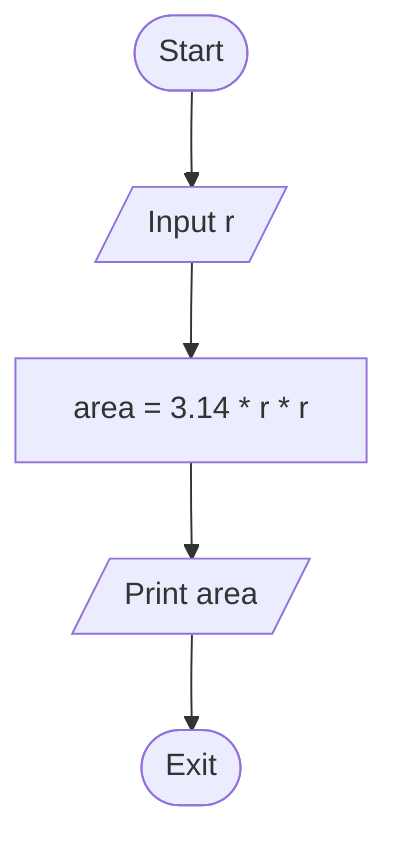
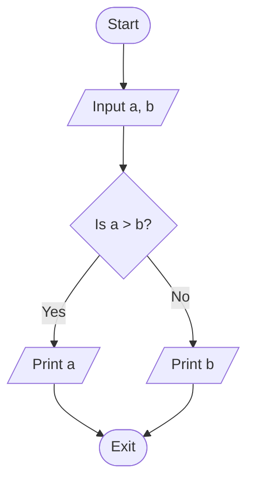
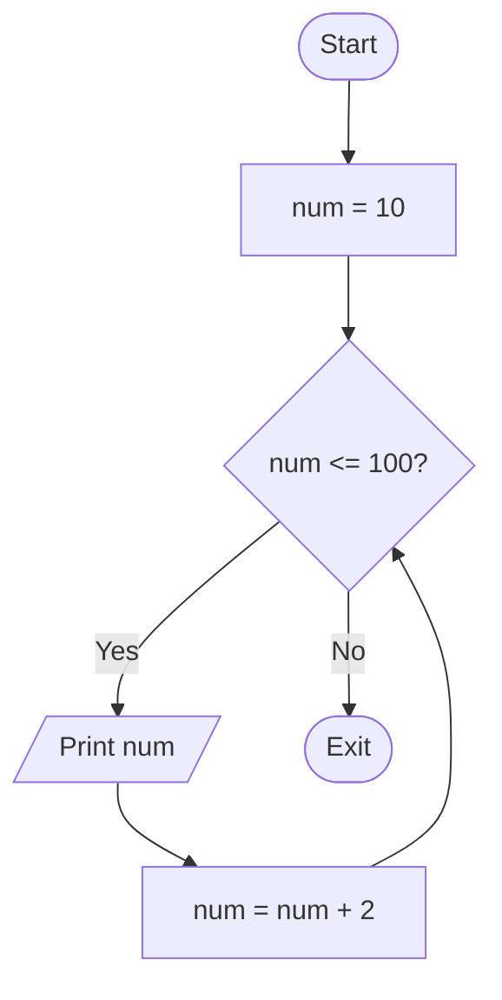
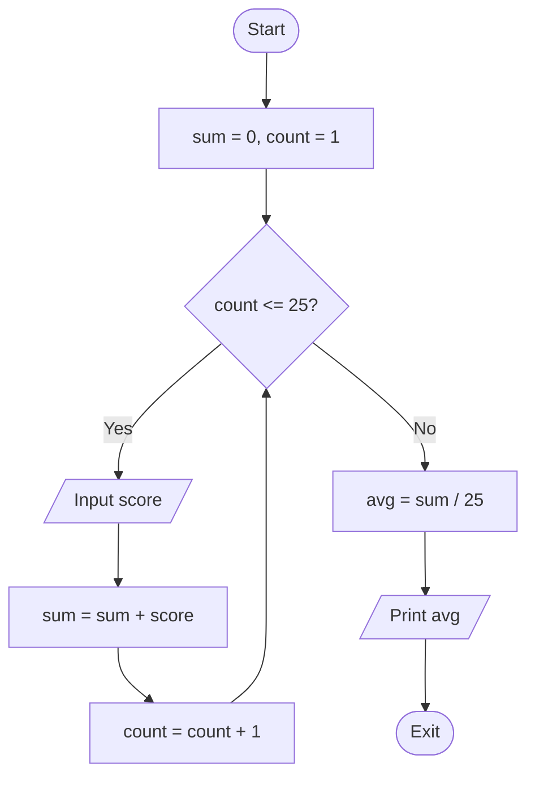

# Practice Question Solutions

This document contains flowcharts and pseudo-code for the practice questions listed in [FLOWCHART.md](./FLOWCHART.md).

---

#### 1. Calculate the Area of a Circle

**Input:**
- Radius of the circle: `r`

**Output:**
- Area of the circle: `area`

**Flowchart:**


**Pseudo-code:**
```text
BEGIN
    READ r
    CALCULATE area = 3.14 * r * r
    PRINT area
END
```

---

#### 2. Find the Greatest of Two Numbers

**Input:**
- First Number: `a`
- Second Number: `b`

**Output:**
- The greater number

**Flowchart:**


**Pseudo-code:**
```text
BEGIN
    READ a
    READ b
    IF a > b THEN
        PRINT a
    ELSE
        PRINT b
    ENDIF
END
```

---

#### 3. Print Even Numbers Between 9 and 100

**Input:**
- None (Range: 9 to 100)

**Output:**
- Even numbers: 10, 12, ..., 100

**Flowchart:**


**Pseudo-code:**
```text
BEGIN
    SET num = 10
    WHILE num <= 100
        PRINT num
        num = num + 2
    ENDWHILE
END
```

---

#### 4. Calculate the Average of 25 Exam Scores

**Input:**
- 25 Exam scores

**Output:**
- Average of the scores: `avg`

**Flowchart:**


**Pseudo-code:**
```text
BEGIN
    SET sum = 0
    SET count = 1
    WHILE count <= 25
        READ score
        sum = sum + score
        count = count + 1
    ENDWHILE
    SET avg = sum / 25
    PRINT avg
END
```
