# Functions

A **Function** is a block of code designed to perform a particular task. It allows us to reuse code multiple times without rewriting it.

## Table of Contents
- [Syntax](#syntax)
- [Function Components](#function-components)
- [Example: Hello World](#example-hello-world)
- [Syntax with Parameters](#syntax-with-parameters)
- [Parameters vs Arguments](#parameters-vs-arguments)
- [Memory & Call Stack](#memory--call-stack)
- [Call by Value](#call-by-value)
- [More Examples](#more-examples)
- [Types of Functions](#types-of-functions)
- [Function Overloading](#function-overloading)
- [Scope of Variables](#scope-of-variables)
- [Practice Questions](#practice-questions)

---

## Syntax

The basic syntax of a function in Java is:

```java
returnType functionName(type parameter1, type parameter2) {
    // body of the function
    return value;
}
```

## Function Components

A function consists of the following parts:

| # | Component | Description |
|---|-----------|-------------|
| 1 | **Return Type** | The data type of the value returned (e.g., `int`, `String`, `void`). |
| 2 | **Function Name** | A unique identifier for the function (CamelCase is standard). |
| 3 | **Parameters** | Inputs to the function (optional). |
| 4 | **Body** | The block of code that defines what the function does. |
| 5 | **Return Statement** | Specifies the value to be returned to the caller. |

> [!NOTE]
> - `void` means the function does not return any value.
> - If the return type is `void`, the `return` statement is optional.
> - We often use access modifiers like `public static`, which define how and where the function can be accessed.

---

## Example: Hello World

Here is a simple function that prints "Hello World".

```java
public static void printHelloWorld() {
    System.out.println("Hello World");
}

public static void main(String[] args) {
    // Calling the function
    printHelloWorld(); 
}
```

> **Key Point**: To execute a function, we must **call** it from the `main` method (or another function).

---

## Syntax with Parameters

We can pass data to functions using parameters.

```java
returnType functionName(type param1, type param2) {
    // code using param1 and param2
    return result; 
}
```

### Example: Sum of Two Numbers

```java
import java.util.Scanner;

public class Functions {
    // Function to calculate sum
    public static int sum(int a, int b) {
        return a + b;
    }

    public static void main(String[] args) {
        Scanner scanner = new Scanner(System.in);
        System.out.print("Enter first number: ");
        int num1 = scanner.nextInt();
        System.out.print("Enter second number: ");
        int num2 = scanner.nextInt();

        // Calling the function and storing the result
        int result = sum(num1, num2);
        System.out.println("Sum is: " + result);
    }
}
```

---

## Parameters vs Arguments

Although often used interchangeably, there is a technical difference:

| Term | Definition | Also Known As |
| :--- | :--- | :--- |
| **Parameter** | Variables defined in the function declaration. | Formal Parameters |
| **Argument** | The actual values passed to the function when it is called. | Actual Parameters |

---

## Memory & Call Stack

Functions in Java occupy memory in a specific area known as the **Stack**.

### How it Works

1.  **Call Stack**: This tracks method calls. It follows the **LIFO** (Last In, First Out) principle.

> 🧠 **Real-life Example: Stack of Plates 🍽️**
> - You put plates one by one on top of each other.
> - When you need a plate, you remove the **top plate first**.
> - 👉 **Last plate placed = First plate removed**. That's LIFO!
2.  **Stack Frame**: When a function is called, a block of memory (Stack Frame) is allocated for it. This frame stores the function's parameters and local variables.
3.  **Execution**: The function at the top of the stack is the one currently running.
4.  **Completion**: When a function returns, its stack frame is destroyed (popped), and control returns to the previous function.

### Visual Representation

```mermaid
block-beta
    columns 1
    block:stack["Call Stack"]
        columns 1
        sum["sum(a, b) — Currently Executing"]
        main["main(args)"]
    end
    
    style sum fill:#4ade80,stroke:#166534
    style main fill:#60a5fa,stroke:#1e40af
```



> The stack grows upwards. `main()` is at the bottom, and `sum()` is pushed on top when called.

---

## Call by Value

Java uses **Call by Value**. This means:

- When we pass a variable to a function, Java passes a **copy** of the variable's value, not the original variable itself.
- Changes made to the parameter inside the function **do not** affect the original variable.

```java
public static void changeValue(int a) {
    a = 10; // This change is only local to this function
}

public static void main(String[] args) {
    int num = 5;
    changeValue(num);
    System.out.println(num); // Output will still be 5
}
```

> [!TIP]
> Contrast this with C++, which supports **Call by Reference** (passing the memory address). Java **always** passes copies of the value. For objects, the "value" passed is a copy of the reference, not the object itself.

---

## More Examples

### Example: Product of Two Numbers

A simple function that returns the product of two integers.

```java
public static int product(int a, int b) {
    int result = a * b;
    return result;
}

public static void main(String[] args) {
    int r = product(5, 3);
    System.out.println(r); // Output: 15
}
```

---

### Example: Factorial of a Number

The factorial of a number `n` (written as `n!`) is the product of all positive integers from 1 to n.

```java
public static int factorial(int a) {
    int fact = 1;
    for (int i = 1; i <= a; i++) {
        fact *= i;
    }
    return fact;
}

public static void main(String[] args) {
    System.out.println(factorial(5)); // Output: 120 (5! = 5*4*3*2*1)
}
```

---

### Example: Binomial Coefficient

The binomial coefficient `C(n, r)` (also written as "n choose r") calculates the number of ways to choose `r` items from `n` items.

**Formula:** `C(n, r) = n! / (r! * (n - r)!)`

```java
public static int binomial(int n, int r) {
    int a = factorial(n);
    int b = factorial(r);
    int c = factorial(n - r);
    int result = a / (b * c);
    return result;
}

public static void main(String[] args) {
    System.out.print(binomial(5, 2)); // Output: 10
}
```

> [!NOTE]
> The `binomial` function reuses the `factorial` function. This demonstrates how functions can call other functions, promoting code reuse.
---

## Types of Functions

| Type | Description |
| :--- | :--- |
| **User-Defined Functions** | Functions created by the programmer to perform specific tasks. |
| **Built-in Functions** | Functions pre-defined in the Java library (e.g., `Math.sqrt()`, `System.out.println()`). |

---

## Function Overloading

Function overloading allows us to create **multiple functions with the same name** but different parameters. Java differentiates them based on:

1.  **Number of parameters**
2.  **Type of parameters**

> [!TIP]
> Instead of creating `multiplyTwoInts()`, `multiplyThreeInts()`, `multiplyTwoDoubles()`, etc., we can simply use **one name**: `multiply()`.

### Example: Calculator

```java
public class Calculator {

    // Two integers
    public static int multiply(int a, int b) {
        return a * b;
    }

    // Three integers
    public static int multiply(int a, int b, int c) { // Overloading by Parameters
        return a * b * c;
    }

    // Two doubles
    public static double multiply(double a, double b) { // Overloading by Data Type
        return a * b;
    }

    // Three doubles
    public static double multiply(double a, double b, double c) {
        return a * b * c;
    }

    public static void main(String[] args) {
        System.out.println(multiply(2, 3));          // Output: 6
        System.out.println(multiply(2, 3, 4));       // Output: 24
        System.out.println(multiply(2.5, 3.5));      // Output: 8.75
        System.out.println(multiply(2.5, 3.5, 4.5)); // Output: 39.375
    }
}
```
### Example: Prime Number
([Prime.java](./Prime.java))

### Example: Prime Number in Range
([Prime.java](./Prime.java))

---

## Binary & Decimal Conversion

### What are Decimal Numbers?
Decimal numbers use digits **0-9** (10 unique digits). This is the standard number system used in mathematics.

### What are Binary Numbers?
Binary numbers use only **0 and 1** (2 digits). This is the number system used by computers/machines.

### Binary to Decimal Conversion

**Steps:**
1. Extract the last digit of the binary number
2. Multiply it with `2^position` (position starts from 0, right to left)
3. Sum up all the values

**Example:** Convert `101` to decimal

| Position | Digit | Calculation | Value |
|----------|-------|-------------|-------|
| 2        | 1     | 1 × 2² = 1 × 4 | 4 |
| 1        | 0     | 0 × 2¹ = 0 × 2 | 0 |
| 0        | 1     | 1 × 2⁰ = 1 × 1 | 1 |
| **Total** | | | **5** |

### Decimal to Binary Conversion

**Steps:**
1. Get the remainder when divided by 2
2. Shift the remainder left by multiplying with 10
3. Repeat until the number becomes 0

📝 [**See Full Code**](./Conversion.java)

---

## Scope of Variables

| Scope Type | Description |
|------------|-------------|
| **Method Scope** | Variables declared inside a method are only accessible within that method |
| **Block Scope** | Variables declared inside a block `{}` are only accessible within that block |

### Think in Terms of "Levels"

| Level | Role | Characteristics |
|-------|------|-----------------|
| 🔹 **Method** | Main Container | Creates stack frame, controls execution, manages parameter/variable lifetime |
| 🔹 **Block** | Sub-Container | Exists inside method, no new stack frame, only limits visibility |

---

## Practice Questions

### Question 1: Average of Three Numbers
Write a Java method to compute the average of three numbers.

📝 [**Solution**](./Solutions/SolutionOne.java)

---

### Question 2: Check Even Number
Write a method named `isEven` that accepts an int argument. The method should return `true` if the argument is even, or `false` otherwise. Also write a program to test your method.

📝 [**Solution**](./Solutions/SolutionTwo.java)

---

### Question 3: Palindrome Number
Write a Java program to check if a number is a palindrome in Java. (121 is a palindrome, 321 is not)

> A number is called a palindrome if the number is equal to the reverse of a number. For example, 121 is a palindrome because the reverse of 121 is 121 itself. On the other hand, 321 is not a palindrome because the reverse of 321 is 123, which is not equal to 321.

📝 [**Solution**](./Solutions/SolutionThree.java)

---

### Question 4: Math Class Methods (Read & Code Exercise)
Search about (Google) & use the following methods of the Math class in Java:

| Method | Description |
|--------|-------------|
| `Math.min()` | Returns the smaller of two values |
| `Math.max()` | Returns the larger of two values |
| `Math.sqrt()` | Returns the square root of a number |
| `Math.pow()` | Returns base raised to the power of exponent |
| `Math.avg()` | ⚠️ Does NOT exist in Java! |
| `Math.abs()` | Returns the absolute (positive) value |

📚 **Free reading resource**: [Java Math - Javatpoint](https://www.javatpoint.com/java-math)

<details>
<summary>📝 <strong>Click to view Solution</strong></summary>

```java
package Functions.Solutions;

/**
 * Solution for Question 4: Math Class Methods
 * Resource: https://www.javatpoint.com/java-math
 */
public class SolutionFour {

    public static void main(String[] args) {
        
        // --- a. Math.min() ---
        System.out.println("=== Math.min() ===");
        System.out.println("min(10, 20) = " + Math.min(10, 20));       // Output: 10
        System.out.println("min(-5, -10) = " + Math.min(-5, -10));     // Output: -10

        // --- b. Math.max() ---
        System.out.println("=== Math.max() ===");
        System.out.println("max(10, 20) = " + Math.max(10, 20));       // Output: 20
        System.out.println("max(-5, -10) = " + Math.max(-5, -10));     // Output: -5

        // --- c. Math.sqrt() ---
        System.out.println("=== Math.sqrt() ===");
        System.out.println("sqrt(16) = " + Math.sqrt(16));             // Output: 4.0
        System.out.println("sqrt(25) = " + Math.sqrt(25));             // Output: 5.0

        // --- d. Math.pow() ---
        System.out.println("=== Math.pow() ===");
        System.out.println("pow(2, 3) = " + Math.pow(2, 3));           // Output: 8.0
        System.out.println("pow(5, 2) = " + Math.pow(5, 2));           // Output: 25.0

        // --- e. Math.avg() ---
        // NOTE: There is NO Math.avg() method in Java!
        System.out.println("=== Average (Custom - no Math.avg() exists) ===");
        int a = 10, b = 20, c = 30;
        double average = (a + b + c) / 3.0;
        System.out.println("Average of 10, 20, 30 = " + average);      // Output: 20.0

        // --- f. Math.abs() ---
        System.out.println("=== Math.abs() ===");
        System.out.println("abs(-10) = " + Math.abs(-10));             // Output: 10
        System.out.println("abs(-3.14) = " + Math.abs(-3.14));         // Output: 3.14
    }
}
```

</details>

📝 [**View Full Solution File**](./Solutions/SolutionFour.java)

---

### Question 5: Sum of Digits
Write a Java method to compute the sum of the digits in an integer.

> **Hint:** Approach this question in the following way:
> 1. Take a variable `sum = 0`
> 2. Find the last digit of the number
> 3. Add it to the sum
> 4. Repeat steps 2 & 3 until the number becomes 0

📝 [**Solution**](./Solutions/SolutionFive.java)

