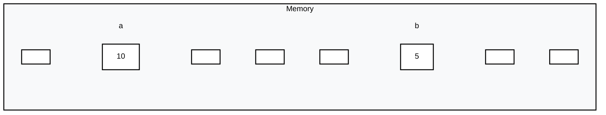
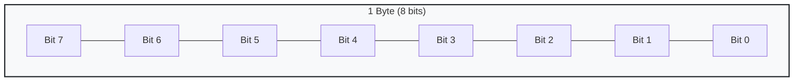

# Java Basics

## Table of Contents
- [Introduction](#introduction)
- [Getting Started](#getting-started)
- [Basic Syntax](#basic-syntax)
- [Variables](#variables)
- [Data Types](#data-types)

## Introduction
Java is a **Statically Typed Language**, which means we must declare the data type of a variable before using it.

## Getting Started

### Creating a Java File
Use the `.java` extension to create a Java file (e.g., `JavaBasics.java`).

### Boilerplate Code
Every Java program must have a class definition and a `main` method.

```java
public class JavaBasics {
    public static void main(String args[]) {
        // Your code starts here
    }
}
```

## Basic Syntax

### Output in Java
To display output to the console:
```java
System.out.print("Hello World");   // Prints on the same line
System.out.println("Hello World"); // Prints and moves cursor to the next line
System.out.print("Hello World\n"); // \n creates a new line manually
```

### Common Symbols
- `;` : **Statement Terminator** (used to end a statement).
- `\n` : **New Line Character** (creates a line break).
- `""` : **String Literals** (encloses text and prints the text inside the quotes).

### Example: Print Pattern
```java
System.out.println("****");
System.out.println("***");
System.out.println("**");
System.out.println("*");
```

## Variables
Variables are containers for storing data values.

### Types of Values
1.  **Literals**: Fixed values that cannot be changed (e.g., `10`, `3.14`, `'A'`).
2.  **Variables**: Named storage locations whose values can be changed during execution.

> **Identifier**: The name given to a variable, class, or method.

### Memory Representation
When a variable is declared, memory is allocated:



- The **value** is stored inside a memory block.
- The **memory block** is identified by the variable name.
- Each block has a unique **address**.
- The **size** of the block depends on the **data type**.

## Data Types
Data types specify the size and type of values that can be stored.

### Classification
- **Primitive Data Types**: Predefined by the language (e.g., `int`, `char`).
- **Non-Primitive Data Types**: User-defined or Reference types (e.g., `String`, `Array`, `Class`).

### Primitive Data Types
Java has 8 primitive data types:

| Data Type | Memory Size | Range | Description |
| :--- | :--- | :--- | :--- |
| **byte** | 1 byte | -128 to 127 | Very small integers |
| **short** | 2 bytes | -32,768 to 32,767 | Small integers |
| **char** | 2 bytes | 0 to 65,535 | Single 16-bit Unicode character |
| **boolean** | 1 bit | `true` or `false` | True/False values |
| **int** | 4 bytes | -2,147,483,648 to 2,147,483,647 | Standard integers |
| **long** | 8 bytes | -9,223,372,036,854,775,808 to ...807 | Large integers |
| **float** | 4 bytes | 1.4E-45 to 3.4E38 | Single-precision floating point |
| **double** | 8 bytes | 4.9E-324 to 1.8E308 | Double-precision floating point |

### Memory Allocation Details
**Why 8 primitive types?**
- To manage memory efficiently.
- Each type has a fixed size suitable for specific ranges of data.

**Byte Structure**
- **1 Byte = 8 Bits**
- A **bit** is the fundamental unit of memory (0 or 1).



#### Example of sum of two numbers
```java
public class JavaBasics {
    public static void main(String args[]) {
        int a = 10;
        int b = 20;
        int sum = a + b;
        System.out.println(sum); // In Java, the right-hand side expression is fully evaluated first, and only then the result is assigned to the variable on the left-hand side.
    }
}
```

#### Comments in Java
```java
// This is a single-line comment
/*
This is a multi-line comment
*/
```
+ comments are used to explain the code
+ comments are not executed by the compiler

#### Input in Java
