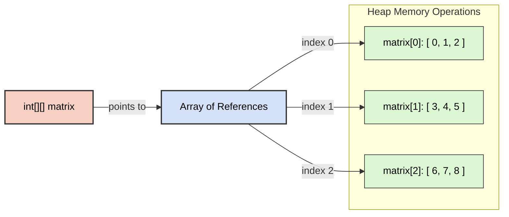

# 2D Arrays in Java

A 2D array can be represented as a matrix consisting of rows and columns. It is used to store data in a two-dimensional format (often conceptualized as X and Y axes). In Java, a 2D array is essentially an **array of arrays**. Under 2D arrays, there are 1D arrays forming the rows.

## Real-life Examples
- **Student marks**: Storing marks of multiple students across multiple subjects (Rows = Students, Columns = Subjects).
- **Storing RGB images**: Pixels on a screen where each point `(x, y)` has a color value.
- **Grids**: Games like Chessboard, Tic-Tac-Toe, or structural mazes.

## Representation
Multi-dimensional arrays extend the concept of a 1D sequence into broader dimensions. 

- **1D Array**: A single sequence of elements.
- **2D Array**: A matrix layout with rows and columns.
- **3D Array**: Multiple 2D matrices forming a cube-like structure.

## Creation and Usage
In Java, we define the dimension size using square brackets `[][]`.

```java
import java.util.Scanner;

public class TwoDArrays {
    public static void main(String args[]) {
        // Declaration of 2D array (3 rows, 3 columns)
        int matrix[][] = new int[3][3];
        Scanner sc = new Scanner(System.in);

        // Input into 2D array
        System.out.println("Enter 9 elements:");
        for (int i = 0; i < matrix.length; i++) {           // rows
            for (int j = 0; j < matrix[0].length; j++) {    // columns
                matrix[i][j] = sc.nextInt();
            }
        }

        // Output formatting
        System.out.println("Matrix contains:");
        for (int i = 0; i < matrix.length; i++) {
            for (int j = 0; j < matrix[0].length; j++) {
                System.out.print(matrix[i][j] + " ");
            }
            System.out.println();
        }
    }
}
```

## 2D Array in Memory

Unlike C/C++ where 2D arrays are stored in a single contiguous memory block using row-major or column-major order, **Java 2D arrays are implemented as an Array of Arrays**.

- The main `matrix` variable holds a reference to a primary array.
- This primary array holds references to individual 1D arrays (the specific rows).
- Each row array is a separate contiguous block in Heap memory. This architecture allows arrays to have varying row sizes (Jagged Arrays).



## Spiral Matrix Pattern

A common algorithms pattern is printing or traversing a 2D matrix in a spiral outward or inward order.

Given the following 4x4 matrix:

|  1 |  2 |  3 |  4 |
|----|----|----|----|
|  5 |  6 |  7 |  8 |
|  9 | 10 | 11 | 12 |
| 13 | 14 | 15 | 16 |

**Expected Spiral Output:** `1 2 3 4 8 12 16 15 14 13 9 5 6 7 11 10`

*To solve this logic, we typically maintain four boundaries (`Top`, `Bottom`, `Left`, `Right`) and navigate systematically through the layers of elements until all locations are visited.*

## Practice Questions

Solutions to practice problems on 2D Arrays:

- **Question 1**: [One.java](./Solutions/One.java) — Count occurrences of an element in a 2D array
- **Question 2**: [Two.java](./Solutions/Two.java) — Extract and sum a specific row from a matrix
- **Question 3**: [Three.java](./Solutions/Three.java) — Print a matrix in row-wise and column-wise order