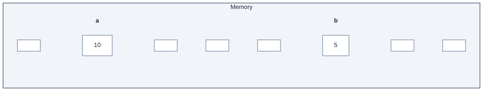
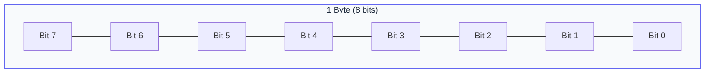
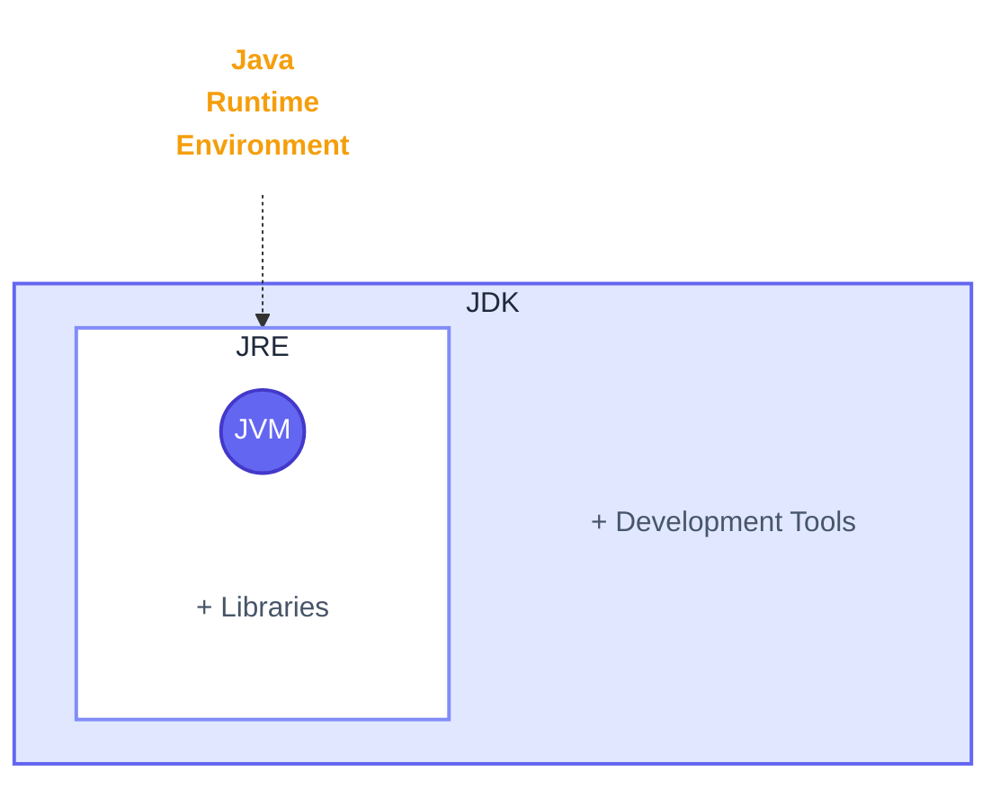
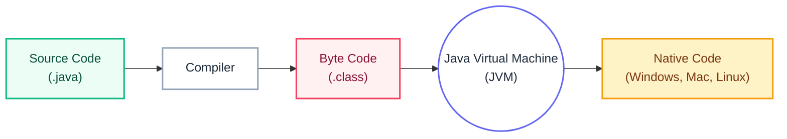

# Java Basics

## Table of Contents
- [Introduction](#introduction)
- [Getting Started](#getting-started)
    - [Creating a Java File](#creating-a-java-file)
    - [Boilerplate Code](#boilerplate-code)
- [Basic Syntax](#basic-syntax)
    - [Output in Java](#output-in-java)
    - [Common Symbols](#common-symbols)
    - [Example: Print Pattern](#example-print-pattern)
- [Variables](#variables)
    - [Types of Values](#types-of-values)
    - [Memory Representation](#memory-representation)
- [Data Types](#data-types)
    - [Classification](#classification)
    - [Primitive Data Types](#primitive-data-types)
    - [Memory Allocation Details](#memory-allocation-details)
- [Input in Java](#input-in-java)
    - [Types of Input Methods](#types-of-input-methods)
    - [Examples: User Input](#examples-user-input)
- [Type Conversion & Casting](#type-conversion--casting)
    - [Type Conversion (Implicit)](#type-conversion-implicit-conversion-widening-conversion)
    - [Type Casting (Explicit)](#type-casting-explicit-conversion-narrowing-conversion)
    - [Type Promotion](#type-promotion)
- [Java Runtime Environment](#how-does-java-code-run)
    - [Execution Flow](#compilation-and-execution-flow)
- [Practice Questions](#practice-questions)

---

## Introduction
Java is a **Statically Typed Language**, which means we must declare the data type of a variable before using it.

## Getting Started

### Creating a Java File
Use the `.java` extension to create a Java file (e.g., `Variables.java`).

### Boilerplate Code
Every Java program must have a class definition and a `main` method. If the file is inside a folder, it should also have a `package` declaration.

```java
package Variables; // Name of the folder

public class Variables { // Name of the file
    public static void main(String args[]) {
        // Your code starts here
    }
}
```

## Basic Syntax

### Output in Java
To display output to the console:
```java
System.out.print("Hello World");   // Prints on the same line
System.out.println("Hello World"); // Prints and moves cursor to the next line
System.out.print("Hello World\n"); // \n creates a new line manually
```

### Common Symbols
- `;` : **Statement Terminator** (used to end a statement).
- `\n` : **New Line Character** (creates a line break).
- `""` : **String Literals** (encloses text and prints the text inside the quotes).

### Example: Print Pattern
```java
System.out.println("****");
System.out.println("***");
System.out.println("**");
System.out.println("*");
```

## Variables
Variables are containers for storing data values.

### Types of Values
1.  **Literals**: Fixed values that cannot be changed (e.g., `10`, `3.14`, `'A'`).
2.  **Variables**: Named storage locations whose values can be changed during execution.

> [!NOTE]
> **Identifier**: The name given to a variable, class, or method.

### Memory Representation
When a variable is declared, memory is allocated:



- The **value** is stored inside a memory block.
- The **memory block** is identified by the variable name.
- Each block has a unique **address**.
- The **size** of the block depends on the **data type**.

## Data Types
Data types specify the size and type of values that can be stored.

### Classification
- **Primitive Data Types**: Predefined by the language (e.g., `int`, `char`).
- **Non-Primitive Data Types**: User-defined or Reference types (e.g., `String`, `Array`, `Class`).

### Primitive Data Types
Java has 8 primitive data types:

| Data Type | Memory Size | Range | Description |
| :--- | :--- | :--- | :--- |
| **byte** | 1 byte | -128 to 127 | Very small integers |
| **short** | 2 bytes | -32,768 to 32,767 | Small integers |
| **char** | 2 bytes | 0 to 65,535 | Single 16-bit Unicode character |
| **boolean** | 1 bit | `true` or `false` | True/False values |
| **int** | 4 bytes | -2,147,483,648 to 2,147,483,647 | Standard integers |
| **long** | 8 bytes | -9,223,372,036,854,775,808 to ...807 | Large integers |
| **float** | 4 bytes | 1.4E-45 to 3.4E38 | Single-precision floating point |
| **double** | 8 bytes | 4.9E-324 to 1.8E308 | Double-precision floating point |

> [!NOTE]
> char uses single quote '' while String uses double quote ""

### Memory Allocation Details
**Why 8 primitive types?**
- To manage memory efficiently.
- Each type has a fixed size suitable for specific ranges of data.

**Byte Structure**
- **1 Byte = 8 Bits**
- A **bit** is the fundamental unit of memory (0 or 1).



### Example: Sum of Two Numbers
```java
package Variables;

public class Variables {
    public static void main(String args[]) {
        int a = 10;
        int b = 20;
        int sum = a + b;
        System.out.println(sum); 
        // In Java, the right-hand side expression is fully evaluated first, 
        // and only then the result is assigned to the variable on the left-hand side.
    }
}
```

### Comments in Java
```java
// This is a single-line comment
/*
This is a multi-line comment
*/
```
- Comments are used to explain the code.
- Comments are not executed by the compiler.

---

## Input in Java
Input is handled using the `Scanner` class from the `java.util` package.

```java
package Variables;
import java.util.Scanner;

public class Variables {
    public static void main(String args[]) {
        Scanner sc = new Scanner(System.in);
        int a = sc.nextInt();
        System.out.println(a);
    }
}
```

### Types of Input Methods
The `Scanner` class provides several methods:
- `next()`: Reads a string until whitespace.
- `nextLine()`: Reads a full line of text (including spaces).
- `nextInt()`: Reads an integer.
- `nextByte()`: Reads a byte.
- `nextFloat()`: Reads a float.
- `nextDouble()`: Reads a double.
- `nextBoolean()`: Reads a boolean.
- `nextShort()`: Reads a short.
- `nextLong()`: Reads a long.

> [!TIP]
> While adding multiple inputs, use `sc.nextLine();` after other inputs to consume the newline character left in the input buffer. You will study more about this later.

### Examples: User Input

#### Sum of Two Numbers
```java
import java.util.Scanner;
public class Variables {
    public static void main(String args[]) {
        Scanner sc = new Scanner(System.in);
        int a = sc.nextInt();
        int b = sc.nextInt();
        int sum = a + b;
        System.out.println(sum);
    }
}
```

#### Product of Two Numbers
```java
import java.util.Scanner;
public class Variables {
    public static void main(String args[]) {
        Scanner sc = new Scanner(System.in);
        int a = sc.nextInt();
        int b = sc.nextInt();
        int product = a * b;
        System.out.println(product);
    }
}
```

#### Area of Circle
```java
import java.util.Scanner;
public class Variables {
    public static void main(String args[]) {
        Scanner sc = new Scanner(System.in);
        float r = sc.nextFloat();
        float area = 3.14f * r * r; // Java considers decimals as 'double' by default; add 'f' for float.
        System.out.println(area);
    }
}
```

---

## Type Conversion & Casting

### Type Conversion (Implicit Conversion) (Widening Conversion)
Type conversion is automatically handled by Java when assigning a value of one data type to another, provided:
1. The types are compatible.
2. The destination type is larger than the source type.

**Order:** `byte` -> `short` -> `int` -> `long` -> `float` -> `double`

- Assigning a larger type to a smaller one results in a "lossy conversion" error.
- Conversion from `char` to `int` is possible because every character has a unique Unicode value (ASCII).

### Type Casting (Explicit Conversion) (Narrowing Conversion)
When you want to convert a larger type to a smaller type, you must explicitly cast it. This tells Java you are aware of potential data loss.

- It will truncate decimal values (not round them).

```java
public class Variables {
    public static void main(String args[]) {
        double d = 10.5;
        int i = (int) d; // explicit conversion: result will be 10
        System.out.println(i);
    }
}
```

### Type Promotion 
- Java automatically promotes `byte`, `short`, and `char` operands to `int` when evaluating an expression.
- If one operand is `long`, `float`, or `double`, the entire expression is promoted to that type respectively.

```java
public class Variables {
    public static void main(String args[]) {
        byte b = 10;
        // b = b + 10; // Error: lossy conversion from int to byte
        b = (byte) (b + 10); // Correct way using type casting
        System.out.println(b);
    }
}
```

---

## How does Java Code Run?


- **JDK (Java Development Kit)**: A collection of tools to develop Java applications.
- **JRE (Java Runtime Environment)**: A part of JDK used to run Java code.
- **JVM (Java Virtual Machine)**: Part of JRE that executes bytecode and uses libraries.

### Compilation and Execution Flow


1. **Source Code**: Program written in a `.java` file.
2. **Compiler**: Part of JDK that converts source code to **Byte Code**.
3. **Byte Code**: Compiled code in `.class` files, which is platform-independent.
4. **JVM**: Runs byte code and converts it to **Native Code** (machine-specific).

---

## Practice Questions

> [!IMPORTANT]
> These questions are designed to help you practice Java logic building, not to test mathematical skills.

### Question 1: Average of 3 Numbers
In a program, input 3 numbers: A, B, and C. You have to output the average of these 3 numbers.
*(Hint: Average of N numbers is the sum divided by N)*

👉 **[View Solution](./Solutions/SolutionOne.java)**

### Question 2: Area of a Square
In a program, input the side of a square. You have to output the area of the square.
*(Hint: Area of a square is `side * side`)*

👉 **[View Solution](./Solutions/SolutionTwo.java)**

### Question 3: Total Bill with GST
Enter the cost of 3 items from the user (using `float` data type): a pencil, a pen, and an eraser. Output the total cost as their bill.
*(Add-on: Try adding 18% GST tax to the items in the bill as an advanced challenge)*

👉 **[View Solution](./Solutions/SolutionThree.java)**

### Question 4: Data Type of Result
What will be the type of result in the following Java code?
```java
byte b = 4;
char c = 'a';
short s = 512;
int i = 1000;
float f = 3.14f;
double d = 99.9954;

result = (f * b) + (i % c) - (d * s);
```
*(Hint: Look at the largest data type among the operands)*

**Answer:**
The result will be of type **`double`**.
In Java's type promotion rules, if any operand in an expression is a `double`, the entire expression is promoted to `double`.

### Question 5: Variable Naming (Advanced)
Will the following statement give any error in Java?
```java
int $ = 24;
```

**Answer:**
**No**, it will not give an error.
In Java, an identifier can start with a letter, an underscore (`_`), or a currency sign (`$`). Therefore, `$` is a valid (though not recommended) variable name.

> The statement int $ = 25; is a valid declaration in Java, but its use is strongly discouraged by convention. 
